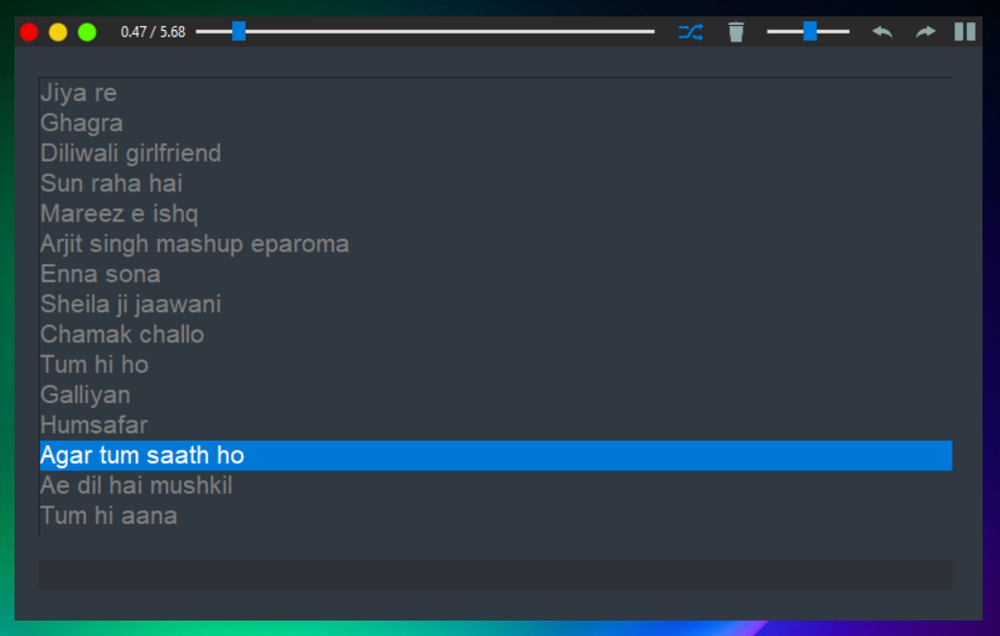

# Minimalistic Python Tkinter YouTube Song Player

---

## Overview

This is a feature-packed, minimalistic Python-based song player with a clean and intuitive Tkinter GUI. The application allows users to easily manage and play songs by downloading them directly from YouTube using a simple input box.

---

## Features

- **Song List Display:** Shows all downloaded songs in a list for quick selection.
- **YouTube Download:** Enter a song name in the input box; the app searches YouTube, finds the most accurate match, downloads the audio, and adds it to the list.
- **Playback Controls:**
  - Play / Pause toggle
  - Next / Previous track navigation
  - Shuffle play option
  - Rewind slider for seeking within a song
  - Volume control slider
- **Song Management:** Delete selected songs from the list and system.
- **Minimalistic UI:** Simple and clean design focused on usability.
